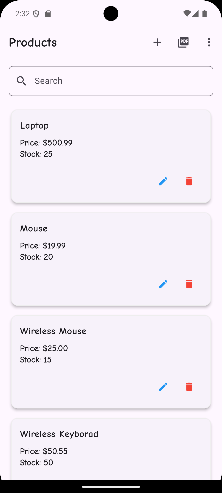
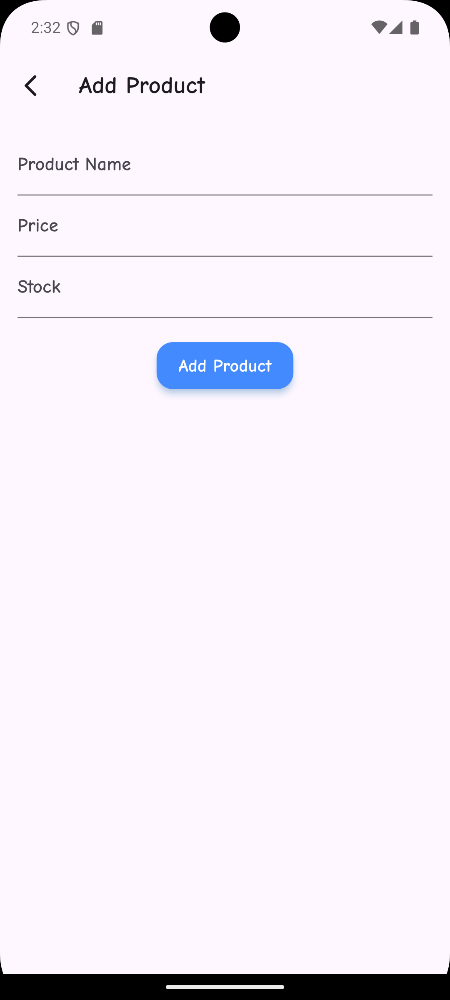
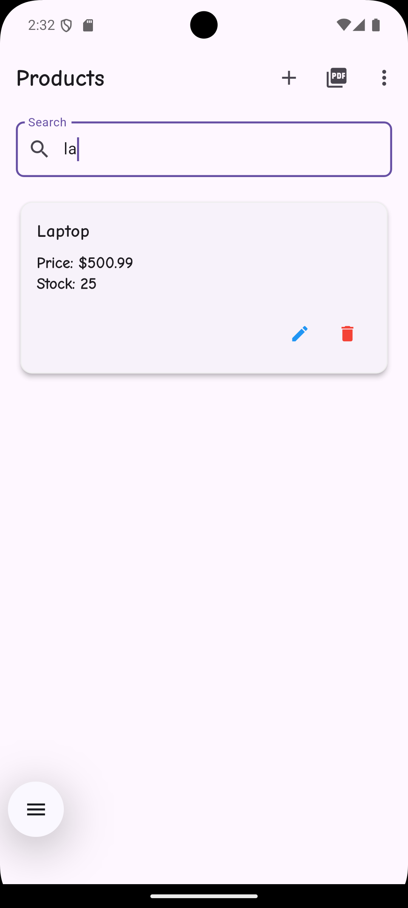
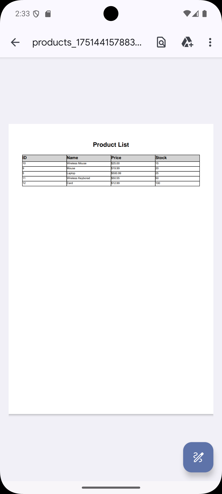
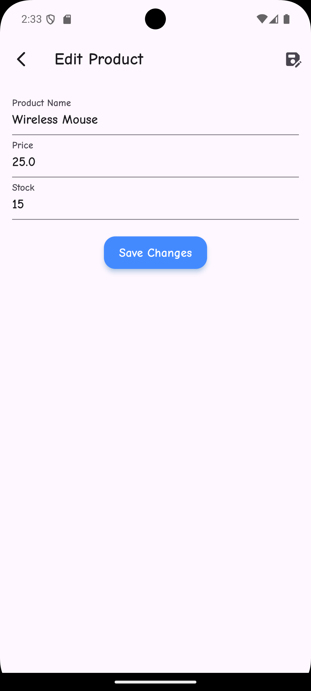

# Product CRUD App

A full-stack application for managing products with Flutter frontend and Node.js + Express API backend.

## Features

- Create, Read, Update, Delete products
- Pull-to-refresh
- Search with debounce
- Sort by name, price, or stock
- Export to PDF
- Form validation
- Error handling

## Technologies

- Frontend: Flutter with Provider state management
- Backend: Node.js with Express
- Database: SQL Server

## Setup

### Frontend

1. Navigate to the Frontend folder:
   ```bash
   cd frontend
   ```
2. Install dependencies:
   ```bash
   flutter pub get
   ```
3. Run application
   ```bash
   flutter run
   ```

### Screen

<div style="display: flex; flex-wrap: wrap; gap: 10px;">
  
  
  
  
  
</div>
